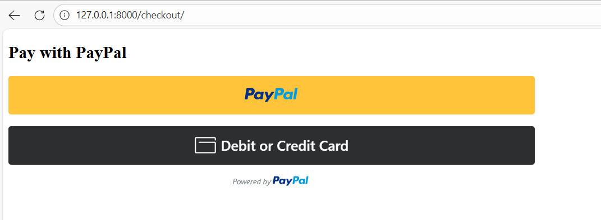

# Django Paypal Payment Gateway Integration
While following the steps of the article, I faced some missing information and steps, so I decided to reproduced this tutorial as a minimal Django application that you can use as an working example and compare your own code to.

Further, this `README` is meant to help you guide through his described steps and set up the same code as shown in this repo.

[![Watch the demo to create sandbox accounts (personal & business)]](https://github.com/Rajdonge/Paypal-Integration-in-Django/raw/main/Paypal%20Integration%20in%20Django.mp4)


# Step 1
- install virtual environment:

`python -m venv venv --prompt=venv` 

- activate virtual environment

`./venv/Scripts/activate`

- install Django within virtual environment

`pip install django`

- start Django project called 'django-paypal'

`django-admin startproject django_paypal`

- navigate into your project folder:

`cd .\django_paypal\`

- start Django app called 'paypal_app'

`django-admin startapp paypal_app `

- add 'paypal_app' to `INSTALLED_APPS` in `settings.py`

```
INSTALLED_APPS = [
    'django.contrib.admin',
    'django.contrib.auth',
    'django.contrib.contenttypes',
    'django.contrib.sessions',
    'django.contrib.messages',
    'django.contrib.staticfiles',

    'paypal_app',
]
```


# Step 2: Set up Paypal Sandbox
- go to to https://developer.paypal.com
- click on `Sandbox accounts`, click on Create account
- open your Paypal-Sandbox app and look for your Client Id and Secret: (create personal account for customer account and business account for merchant account)
- click on business account and create a app, and get the client id.
- in `settings.py` add the following two lines to the bottom:
```
PAYPAL_CLIENT_ID = 'your_paypal_client_id'
```
(Replace each string with the actual Client Id from your Paypal Sandbox)

*Note: These should not be shared, e.g. on GitHub. Thus, you can create a new file called `credentials.py` in your project and place bothe lines there.*

Then, import both variables to your `views.py`:
`from django_paypal.credentials import PAYPAL_CLIENT_ID`

Finally, updated the configuration part to:
```
def checkout(request):
    return render(request, "checkout.html", {
        "paypal_client_id": PAYPAL_CLIENT_ID
    })
```

# Step 3: Create Views
Create three views:
- checkout
- payment_success
- payment_failed

```
# views.py

from django.conf import settings
from django.shortcuts import render
from django.views.decorators.csrf import csrf_exempt
import json

def checkout(request):
    return render(request, "checkout.html", {
        "paypal_client_id": settings.PAYPAL_CLIENT_ID
    })

@csrf_exempt
def payment_success(request):
    if request.method == "POST":
        data = json.loads(request.body)
        order_id = data.get("id")
        print("Payment successful. Order ID:", order_id)
        return render(request, "payment_success.html")
    else:
        return render(request, "payment_success.html")

def payment_failed(request):
    return render(request, "payment_failed.html")
```

# Step 4: Create Templates and URL’s
- in your app folder create a folder named 'templates'

## Create checkout.html
```
<!DOCTYPE html>
<html>
<head>
    <title>PayPal Checkout</title>

    <!-- OFFICIAL PAYPAL SDK -->
    <script src="https://www.paypal.com/sdk/js?client-id={{ paypal_client_id }}&currency=USD&intent=capture"></script>
</head>
<body>

<h2>Pay with PayPal</h2>

<div id="paypal-button-container"></div>

<script>
paypal.Buttons({
    createOrder: function (data, actions) {
        return actions.order.create({
            purchase_units: [{
                amount: {
                    value: "10.00"
                }
            }]
        });
    },

    onApprove: function (data, actions) {
        return actions.order.capture().then(function (details) {
            fetch("", {
                method: "POST",
                headers: {
                    "Content-Type": "application/json",
                    "X-CSRFToken": "{{ csrf_token }}"
                },
                body: JSON.stringify(details)
            }).then(() => {
                window.location.href = "";
            });
        });
    },

    onCancel: function () {
        window.location.href = "";
    },

    onError: function (err) {
        console.error("PayPal error:", err);
        alert("Payment error – check console");
    }
}).render("#paypal-button-container");
</script>

</body>
</html>
```

## Create payment_failed.html
```
<!DOCTYPE html>
<html>
<head>
    <title>Payment Failed</title>
</head>
<body>
<h1>Payment Failed</h1>
<p>Something went wrong. Please try again.</p>
<a href="">Back to Checkout</a>
</body>
</html>
```

## Create success.html
```
<!DOCTYPE html>
<html>
<head>
    <title>Payment Successful</title>
</head>
<body>
<h1>Payment Successful</h1>
<p>Order ID: {{ order_id }}</p>
<p>Thank you for your purchase!</p>
<a href="">Back to Checkout</a>
</body>
</html>
``` 

## Add URL patterns for your views

In the `urls.py` within your project folder import your `views.py`:

`from paypal_app import views`

Include the new urls:
```
urlpatterns = [
    ...
    path("checkout/", views.checkout, name="checkout"),
    path("success/", views.payment_success, name="payment_success"),
    path("failed/", views.payment_failed, name="payment_failed"),
]
```

# Step 5: Start Server
Start your app
`python manage.py runserver`

*Note: Since we haven defined a default url (for`http://127.0.0.1:8000/`) we will get an error:
`Page not found (404)`*

This is not a problem, simply continue.

Navigate to:
`http://127.0.0.1:8000/checkout/`

The checkout page will look like this:



When clicking on `Paypal`, we are asked to login into Paypal.

*Note: Check the url. You will see that we are asked to log into the Sandbox-Paypal account.*

Login with the personal account that we previously created.

Confirm the payment. You should be redirected to your `payment_success.html` page.

# Step 6: Confirm payment

Go to: https://sandbox.paypal.com

Log in using the business Sandbox account.

(Go to https://developer.paypal.com/dashboard/accounts and click on the account with `...@business.example.com`)

Check if the payment occurs in your recent activity.
